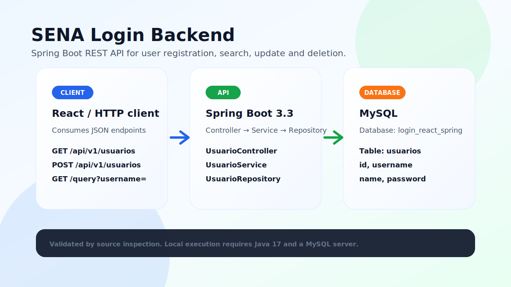

# SENA Login Backend Spring

Backend REST para la evidencia SENA de login y gestión de usuarios. El proyecto expone endpoints CRUD sobre una entidad `UsuarioModel` y persiste la información en MySQL usando Spring Data JPA.



## Stack

- Java 17
- Spring Boot 3.3.0
- Spring Web
- Spring Data JPA
- MySQL Connector/J
- Maven Wrapper
- Empaquetado WAR con Tomcat `provided`

## Arquitectura

```text
HTTP client / frontend
        ↓
UsuarioController
        ↓
UsuarioService
        ↓
UsuarioRepository
        ↓
MySQL: login_react_spring.usuarios
```

## Modelo principal

`UsuarioModel` representa la tabla `usuarios` con estos campos:

| Campo | Tipo | Descripción |
| --- | --- | --- |
| `id` | `Long` | Identificador autogenerado |
| `username` | `String` | Nombre de usuario usado para búsquedas |
| `name` | `String` | Nombre visible del usuario |
| `password` | `String` | Contraseña enviada por el cliente |

> Nota técnica: este proyecto no incluye Spring Security ni cifrado de contraseñas. Para producción se debe agregar hashing, validaciones y reglas de autorización antes de exponerlo públicamente.

## Configuración

Crear una base de datos MySQL local:

```sql
CREATE DATABASE login_react_spring;
```

Configurar las credenciales mediante variables de entorno o editar `src/main/resources/application.properties` para tu entorno local:

```properties
spring.application.name=login
spring.datasource.url=${DB_URL:jdbc:mysql://localhost:3306/login_react_spring}
spring.datasource.username=${DB_USERNAME:root}
spring.datasource.password=${DB_PASSWORD:}
spring.jpa.hibernate.ddl-auto=update
```

## Ejecución local

```bash
./mvnw spring-boot:run
```

La API queda disponible por defecto en:

```text
http://localhost:8080/api/v1/usuarios
```

## Endpoints

| Método | Ruta | Uso |
| --- | --- | --- |
| `GET` | `/api/v1/usuarios` | Lista todos los usuarios |
| `GET` | `/api/v1/usuarios/{id}` | Busca un usuario por id |
| `GET` | `/api/v1/usuarios/query?username={username}` | Busca usuarios por username |
| `POST` | `/api/v1/usuarios` | Crea o actualiza un usuario |
| `DELETE` | `/api/v1/usuarios/{id}` | Elimina un usuario por id |

### Crear usuario

```http
POST /api/v1/usuarios
Content-Type: application/json
```

```json
{
  "username": "usuario.demo",
  "name": "Usuario Demo",
  "password": "cambiar-antes-de-produccion"
}
```

### Actualizar usuario

El mismo endpoint `POST /api/v1/usuarios` actualiza cuando el cuerpo incluye un `id` existente:

```json
{
  "id": 7,
  "username": "usuario.actualizado",
  "name": "Usuario Actualizado",
  "password": "cambiar-antes-de-produccion"
}
```

## Validación

En esta actualización se revisó el código fuente y la estructura del proyecto. La ejecución local no pudo completarse en esta máquina porque no hay un Java Runtime instalado.

Comando intentado:

```bash
./mvnw test
```

Resultado del entorno:

```text
Unable to locate a Java Runtime.
```

## Estructura relevante

```text
src/main/java/com/blaper/login
├── controllers/UsuarioController.java
├── models/UsuarioModel.java
├── repositories/UsuarioRepository.java
├── services/UsuarioService.java
├── LoginApplication.java
└── ServletInitializer.java
```
